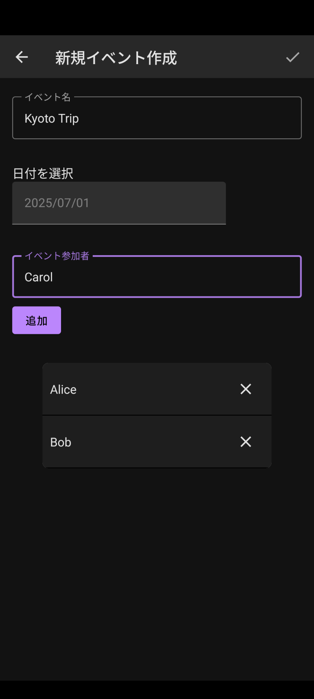
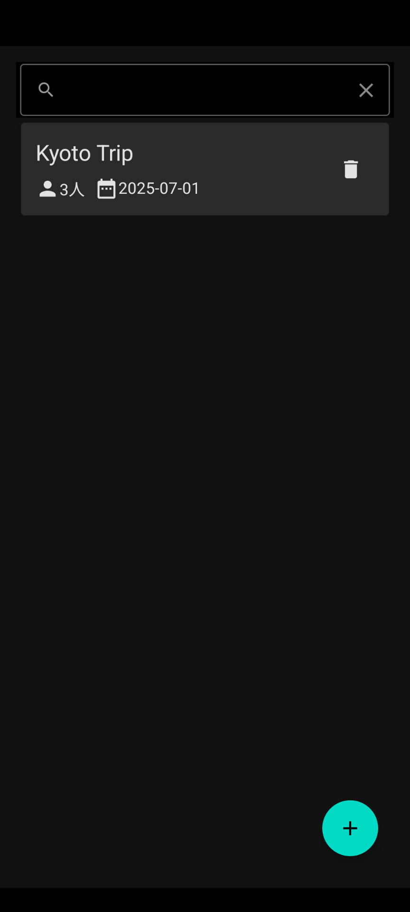
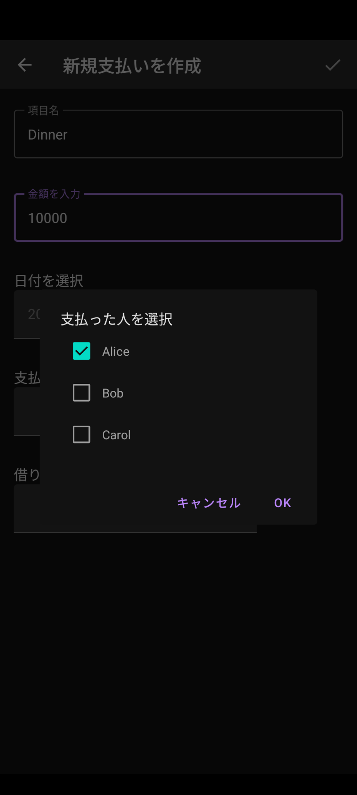
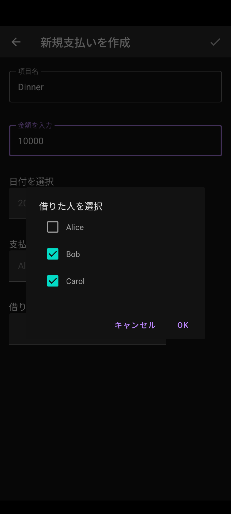
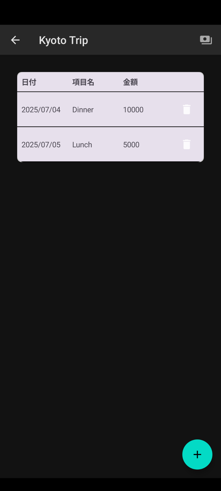
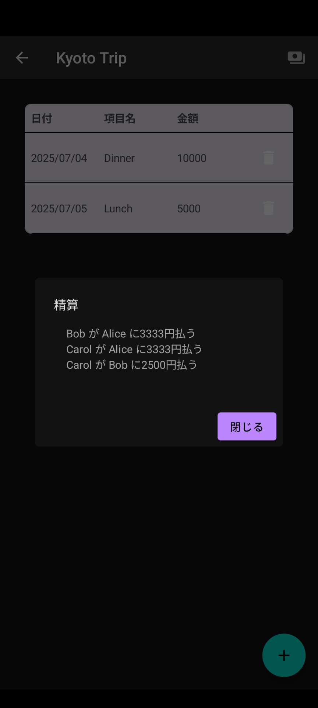

# 🧮 Split Payment Manager
An Android application to easily manage and settle shared expenses among multiple users.

## 🚀 Features
### Event-based expense management
* Create events (like trips, parties, or group activities) to track shared payments.

* Multiple payments per event
Record multiple payments for each event, specifying:
  * Amount paid
  * Who paid
  * Who benefited (participants)

* Instant settlement calculation
    * Automatically calculate who owes whom and how much, so you can settle up effortlessly.

* Supports multiple users
  * Manage expenses across different users seamlessly.

## 🛠️ Getting Started
### Prerequisites
* Android Studio (latest stable version recommended)

* Android device or emulator running Android 8.0 (API 26) or higher

### Build & Run
1. Clone this repository:
````
git clone https://github.com/yourusername/your-repo-name.git
````
2. Open the project in Android Studio.
3. Sync Gradle and run the app on your device or emulator.

## ✏️ Usage
1. Create an Event:
    * For example, "Kyoto Trip".
    * 
    * 

2. Add Payments:
   * For each expense, enter:
        * The amount
        * Who paid
        * Who shared (participants)
   * 
   * 
   * 
3. View Settlements:
   * Instantly see who needs to pay whom, and how much.
   * 

### 💡 Example
| Event      | Payment by | Amount  | Participants      |
|------------|------------|---------|-------------------|
| Kyoto Trip | Alice      | ¥10,000 | Alice, Bob, Carol |
| Kyoto Trip | Bob        | ¥5,000  | Bob, Carol        |

#### ➡️ Settlement Result:
* Carol pays Alice ¥3,333
* Carol pays Bob ¥2,500
* Bob pays Alice ¥3,333

(Amounts automatically balanced for equal sharing.)